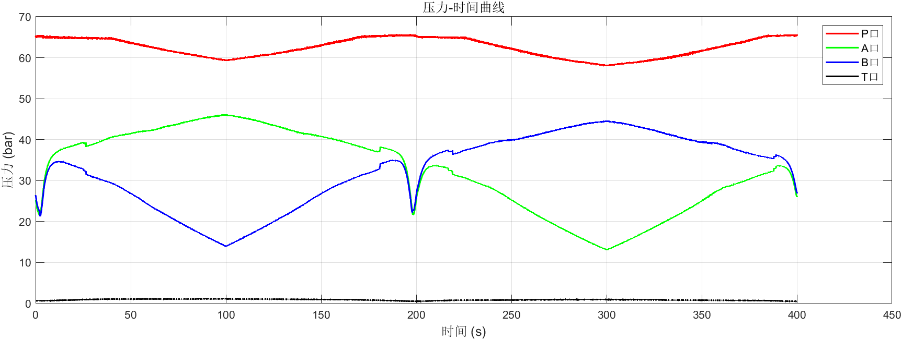
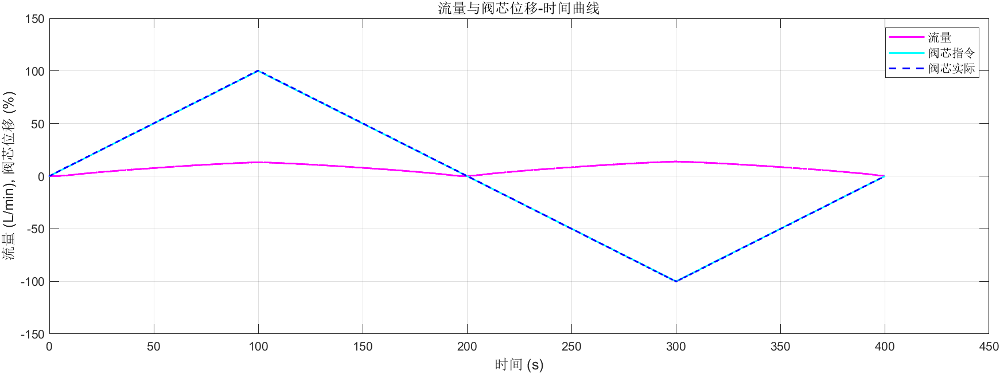
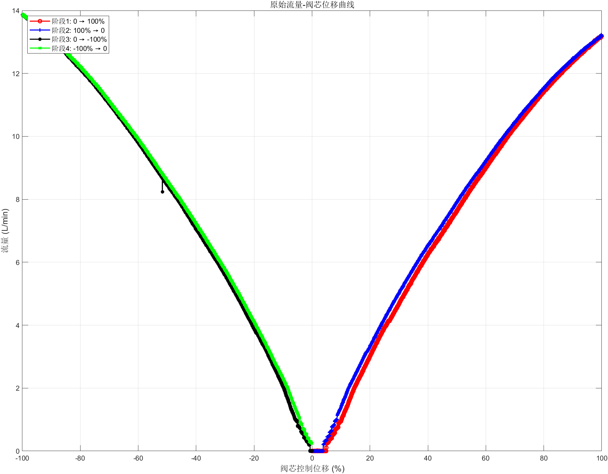
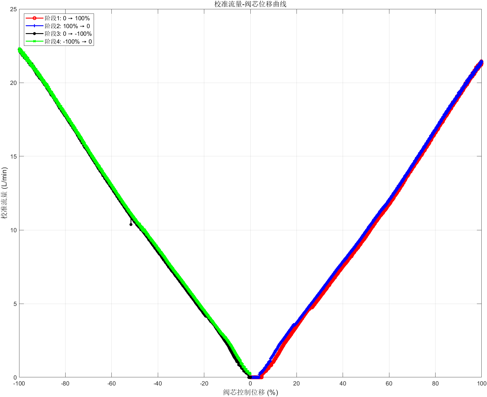
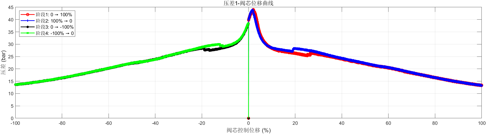
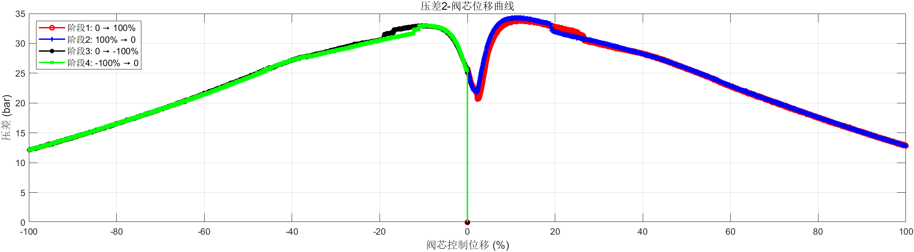

# 液压阀流量特性分析报告
---
### 数据采集
实验数据在液压阀测试阶段采集。数据包括各端口压力的测量值以及不同控制信号下的流量。

### 数据处理
数据处理包括以下步骤：
1. 读取实验数据；
2. 识别控制信号的关键点；
3. 绘制压力和流量随时间变化的特性曲线；
4. 根据压差对流量进行校准处理。

## 结果
分析结果总结如下：

### 关键性能参数
==== 液压阀性能参数 ====
1. 额定流量 (100%): 21.31 L/min
   额定流量 (-100%): 22.23 L/min
2. 增益 (流量/位移):
   阶段 1: 0.2230 (L/min)/%
   阶段 2: 0.2199 (L/min)/%
   阶段 3: -0.2242 (L/min)/%
   阶段 4: -0.2219 (L/min)/%
3. 死区:
   正向: 10.16 %
   负向: 5.93 %
4. 迟滞:
   正向: 2.37 %
   负向: 1.73 %
5. 线性度 (最大拟合偏差):
   阶段 1: 5.19 %
   阶段 2: 3.60 %
   阶段 3: 4.18 %
   阶段 4: 1.92 %
6. 对称性 (负/正流量比): 104.36 %
7. 极性正确: false ==这个感觉有点奇怪==

### 数据可视化

*图1：压力-时间曲线*

*图2：流量-阀芯位移曲线*

*图3:原始流量-阀芯位移曲线*

*图4：校准后-阀芯位移曲线*

*图5：压差曲线*
正向压差为P-A(压差1), B-T(压差2),反向压差为P-B(压差1), A-T(压差2)

## 讨论
分析揭示了液压阀性能的诸多重要特性。计算得到的参数反映了阀门在不同控制信号下的效率和响应特性。观察到的滞后和死区为阀门设计和控制策略的改进提供了方向。

## 结论
综上所述，液压阀分析全面揭示了其流量特性。结果可用于提升阀门性能并指导后续设计优化。后续研究可聚焦于优化控制算法，以进一步减小滞后和死区。

